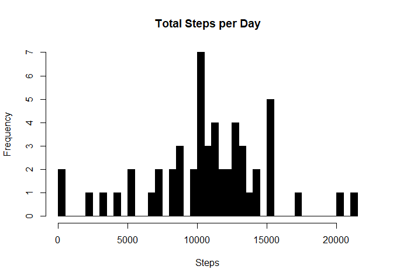
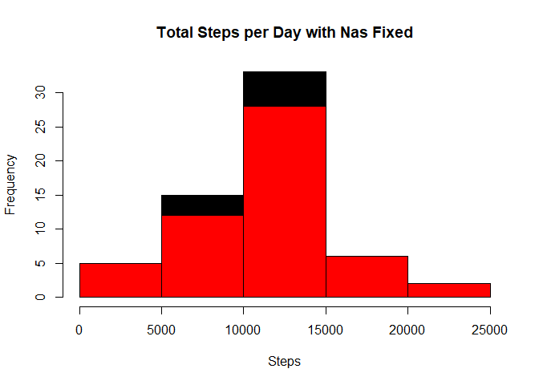
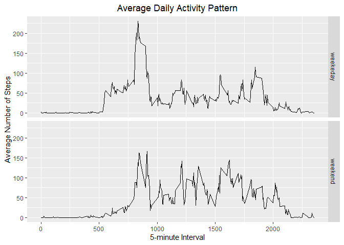

# PPROJECT 1 “REPRODUCIBLE RESEARCH”

## Introducción

It is now possible to collect a large amount of data about personal
movement using activity monitoring devices such as a Fitbit, Nike
Fuelband, or Jawbone Up. These type of devices are part of the
“quantified self” movement – a group of enthusiasts who take
measurements about themselves regularly to improve their health, to find
patterns in their behavior, or because they are tech geeks. But these
data remain under-utilized both because the raw data are hard to obtain
and there is a lack of statistical methods and software for processing
and interpreting the data.

## Assigment

This assignment makes use of data from a personal activity monitoring
device. This device collects data at 5 minute intervals through out the
day. The data consists of two months of data from an anonymous
individual collected during the months of October and November, 2012 and
include the number of steps taken in 5 minute intervals each day.

[Here you can download the
data](https://d396qusza40orc.cloudfront.net/repdata%2Fdata%2Factivity.zip)

The variables included in this dataset are:

-   **steps**: Number of steps taking in a 5-minute interval  
-   **date**: The date on which the measurement was taken in YYYY-MM-DD
    format
-   **interval**: Identifier for the 5-minute interval in which
    measurement was taken

#### Questions to be answered:

-   What is mean total number of steps taken per day?
-   What is the average daily activity pattern?
-   Imputing missing values
-   Are there differences in activity patterns between weekdays and
    weekends?

<!-- -->

    knitr::opts_chunk$set(warning=FALSE)

### Library Requeriments

    library(ggplot2)
    library(plyr)

# Loading and preprocessing the data

    if (!file.exists("data"))
    {
        dir.create("data")
        url <-  "https://d396qusza40orc.cloudfront.net/repdata%2Fdata%2Factivity.zip"
        download.file(url, destfile = "./data/activities.zip")
        setwd("./data")
        unzip("activities.zip")
    }
    # 1.1- Load the data in the file "activity.csv"
    rawActivity <- read.csv("./data/activity.csv")
    summary(rawActivity, echo = TRUE)

    ##      steps            date              interval     
    ##  Min.   :  0.00   Length:17568       Min.   :   0.0  
    ##  1st Qu.:  0.00   Class :character   1st Qu.: 588.8  
    ##  Median :  0.00   Mode  :character   Median :1177.5  
    ##  Mean   : 37.38                      Mean   :1177.5  
    ##  3rd Qu.: 12.00                      3rd Qu.:1766.2  
    ##  Max.   :806.00                      Max.   :2355.0  
    ##  NA's   :2304

    # Processing the Data (Obtain te days with the date of rawActivity)
    rawActivity$day <- weekdays(as.Date(rawActivity$date))
    # Pongo en formato POSIXCT la fecha y lo llamo DateTime
    rawActivity$DateTime <- as.POSIXct(rawActivity$date, format="%Y-%m-%d")
    ## pulling data without nas
    dataClean <- rawActivity[!is.na(rawActivity$steps),]

# What is mean total number of steps taken per day?

    ## summarizing total steps per date
    sumDataFrame <- aggregate(rawActivity$steps ~ rawActivity$date, FUN = sum,)
    # Asignarle nombre a cada colunda creada en la variable "sumDataFrame"
    colnames(sumDataFrame) <- c("Date", "Steps")
    # Make a histogram of the total number of steps taken each day
    hist(sumDataFrame$Steps, breaks = 50, xlab = "Steps", main = "Total Steps per Day", col = "black", echo = TRUE)

    ## Mean of Steps
    meanSteps <- as.integer(mean(sumDataFrame$Steps))
    meanSteps

    ## [1] 10766

    ## Median of Steps
    medianSteps <- as.integer(median(sumDataFrame$Steps))
    medianSteps

    ## [1] 10765

-The average number of steps taken each day was 10766 steps.

-The median number of steps taken each day was 10765 steps.

# What is the average daily activity pattern?

    ## create average number of steps per interval
    intervalDataFrame <- ddply(dataClean, .(interval), summarize, Avg = mean(steps))

    ## Create line plot of average number of steps per interval
    ggplot1 <- ggplot(intervalDataFrame, aes(x = interval, y = Avg), xlab = "Interval", ylab = "Average Number of Step" ) 
    ggplot1 + geom_line() + xlab("Interval") + ylab("Average Number of Steps") + ggtitle("Average Number of Steps per Interval") 

    ## Maximum steps by interval
    stepsMax <- max(intervalDataFrame$Avg)
    stepsMax

    ## [1] 206.1698

    ## Which interval contains the maximum average number of steps
    maxIntervalSteps <- intervalDataFrame[intervalDataFrame$Avg == stepsMax,]
    maxIntervalSteps

    ##     interval      Avg
    ## 104      835 206.1698

-The max interval of Steps is 835

-The max Average per Day is 2016.1698

# Imputing Missing Values

    # Number of NAs in original data set
    totalNas <- rawActivity[,1]
    totalNrow <- nrow(rawActivity[is.na(totalNas),])
    totalNrow

    ## [1] 2304

The total number of rows with steps = ‘NA’ is 2304.

    # Create the average number of steps per weekday and interval
    avgDataFrame <- ddply(dataClean, .(interval, day), summarize, Avg = mean(steps))
    # Create dataset with all NAs for substitution
    naData <- rawActivity[is.na(rawActivity$steps),]
    # Merge NA data with average weekday interval for substitution
    newData <- merge(naData, avgDataFrame, by = c("interval", "day"))
    # Reorder the new substituded data in the same format as clean data set
    newData2 <- newData[,c(6,4,1,2,5)]
    colnames(newData2) <- c("steps", "date", "interval", "day", "DateTime")
    # Merge the NA averages and non NA data together
    dataMerge <- rbind(dataClean, newData2)
    # Create sum of steps per date to compare with step 1
    sumDataFrame2 <- aggregate(dataMerge$steps ~ dataMerge$date, FUN = sum, )
    colnames(sumDataFrame2) <- c("Data", "Steps")
    # Mean of Steps with NA data taken care of
    meanStepsNa <- as.integer(mean(sumDataFrame2$Steps))
    # Median of Steps with NA data taken care of
    medianStepsNa <- as.integer(median(sumDataFrame2$Steps))

    ## Creating the histogram of total steps per day, categorized by data set to show impact
    hist(sumDataFrame2$Steps, breaks = 5, xlab = "Steps", main = "Total Steps per Day with Nas Fixed", col = "black")
    hist(sumDataFrame$Steps, breaks = 5, xlab = "Steps", main = "Total Steps per Day with NAs Fixed", col = "red", add = T)

# Are there differences in activity patterns between weekdays and weekends?

    DayType <- function(date) {
      day <- weekdays(date)
      if (day %in% c('Monday', 'Tuesday', 'Wednesday', 'Thursday', 'Friday'))
          return ("weekeday")
      else if (day %in% c('Saturday', 'Sunday'))
          return ("weekend")
      else
          stop ("Invalid Date Format.")
    }
    meanStepsByInt <- aggregate(steps ~ interval, rawActivity, mean)

    imp_activityData <- transform(rawActivity,
                                  steps = ifelse(is.na(rawActivity$steps),
                                                 meanStepsByInt$steps[match(rawActivity$interval, 
                                                                            meanStepsByInt$interval)],
                                                 rawActivity$steps))

    imp_activityData$date <- as.Date(imp_activityData$date)
    imp_activityData$day <- sapply(imp_activityData$date, FUN = DayType)

    # Make a panel plot containnig a time-series plot of the 5-minute interval
    # and the average number of steps taken across all weekdays or weekends
    meanStepsByDay <- aggregate(steps ~ interval + day, imp_activityData, mean)
    ggplot(data = meanStepsByDay, aes(x = interval, y = steps)) + 
      geom_line() +
      facet_grid(day ~ .) +
      ggtitle("Average Daily Activity Pattern") +
      xlab("5-minute Interval") +
      ylab("Average Number of Steps") +
      theme(plot.title = element_text(hjust = 0.5))

